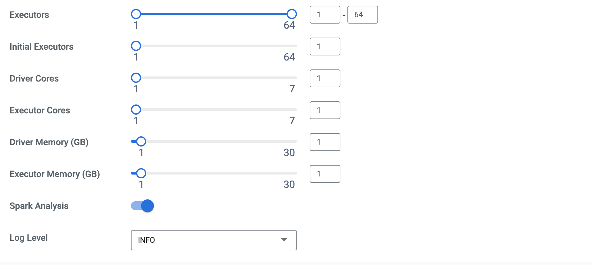
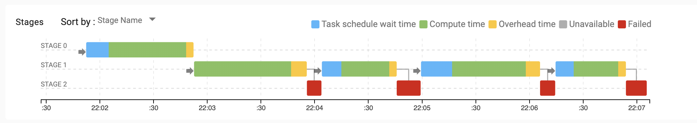
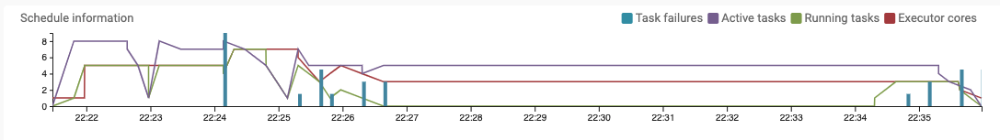
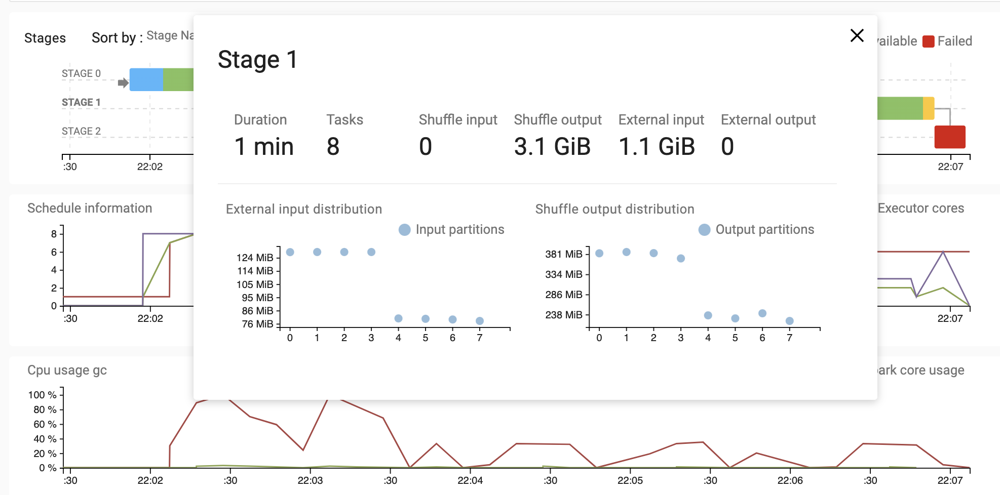
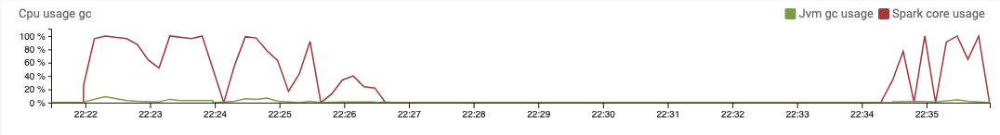
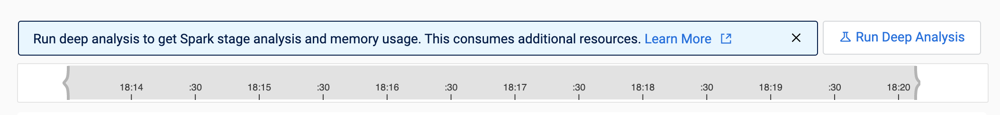
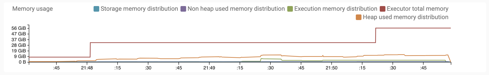
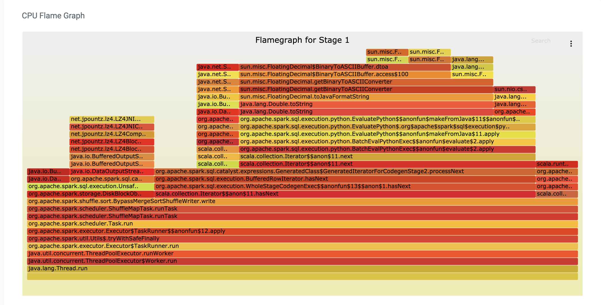

# CDE_tuning_demo

The Cloudera Data Engineering Spark **Analysis** features provide consolidated views of stage dependency, scheduling and performance metrics for each run of your application.  Additional information can be found in the [Cloudera documentation](https://docs.cloudera.com/data-engineering/cloud/troubleshooting/topics/cde-deep-analysis.html) and also [this blog post](https://blog.cloudera.com/demystifying-spark-jobs-to-optimize-for-cost-and-performance/).

This repository provides a simple, standalone application and a step-by-step walk-though of troubleshooting and tuning for it using CDE job Analysis features.

## Setup
The application was tested on a virtual cluster with 32 cores and 128GB max resources (node size = 8 core / 32GB).  It's also assumed that you are:
1.  familiar with the CDE CLI (see the [CDE_CLI_demo](https://github.com/curtishoward/CDE_CLI_demo) for examples)
2.  able to create tables under the Hive ```default``` database

We'll first create a resource with the application files each job we will use:
```
cde resource create --name tuning-demo-files
cde resource upload --local-path demo_table_gen.py --name tuning-demo-files 
cde resource upload --local-path etl_job.py --name tuning-demo-files 
```

Next, we'll create and run the ```gen_table``` job to create a 1G table that will be used in our example (Hive table: ```default.tuning_demo_input_table```):
```
cde job create --application-file /app/mount/demo_table_gen.py --name gen_table \
    --executor-cores 1 --executor-memory 8G --type spark --mount-1-resource tuning-demo-files
cde job run --name gen_table
```

We can now create the ```etl_job``` application that we'll troubleshoot and tune:
```
cde job create --application-file /app/mount/etl_job.py --name etl_job --executor-cores 1 \
    --executor-memory 1G --type spark --mount-1-resource tuning-demo-files
```

Be sure to also enable the CDE Spark Analysis option from the Job's Configuration Edit page:


Finally, run the job:
```
cde job run --name etl_job 
```

As curently configured, the job should fail. 

## CDE Job Analysis
Some common approaches to identify the root cause of the job failure would be to review the Spark History UI or the driver and executor logs for the application.  For small, simple jobs this could be a reasonable approach; however, for more complex applications (especially those you may be unfamiliar with), finding the source of a problem can be a tedious process of clicking through multiple levels of the Spark History UI or of reviewing potentially very large logs which combine logging events from all tasks and stages over the timeline of the application.  This is where CDE's Job Analysis provides a helpful consolidated view that will help you quickly identify problems and bottlenecks.


### Stage View
The Analysis tab consolidates Spark stage information for the job run.  Understanding the dependencies and order of the overall execution across these stages from the Spark History and logs can be non-trivial.  The CDE Analysis view makes it immediately obvious which stages took the longest or were dependencies of others, potentially highligting bottlenecks.  The color coding also summarizes the component of time spend waiting for resources versus executing, per stage, which can help developers decide on the correct balance of 'warm', always-on resources and auto-scaling limits to align with expected responsiveness required to meet SLAs:


The scheduler graph also summarizes how quickly stage tasks are processed, which is related to how quickly and to what extend resources are auto-scaled.  This also can be a useful tool when deciding how to configure the CDE service-level on-demand and spot instance limits (min/max), as well as Virtual cluster max limits:


### Stage Drill-Down
Selecting a particular stage from the high level CDE job Analysis view will show a summary graph of input and output sizes for that stage.  Using this view, it's obvious that there is skew in the input data that we're sorting:


Under the Spark UI tab, we can confirm that there were task failures which resulted in the eventual stage failure, due to out-of-memory (OOM) errors (likely made worse because of the skew):
```
ExecutorLostFailure (executor 15 exited caused by one of the running tasks) Reason: 
The executor with id 15 exited with exit code 137.
...
	 exit code: 137
	 termination reason: OOMKilled
```     

Garbage collection spikes can also be a good indicator of memory contention in the job, as the JVM struggles to handle allocation requests (although for this job run, GC stayed close to 0%, see the green line):



#### Address the Problem
Some options to resolve the issue of skewed data would be to use [key salting](https://medium.com/appsflyer/salting-your-spark-to-scale-e6f1c87dd18), higher parallelism using [repartition](https://spark.apache.org/docs/latest/api/python/reference/api/pyspark.sql.DataFrame.repartition.html), or potentially Spark 3's [AQE](https://blog.cloudera.com/how-does-apache-spark-3-0-increase-the-performance-of-your-sql-workloads/).  For the purposes of this example, we will simply increase the executor memory from 1GB to 8GB:
```
cde job update --name etl_job --executor-memory 8G
```

### Tuning
With 8GB per executor, the job should now complete successfully.  Run *deep analysis* for the job run by clicking the button in the Analysis tab:


We can now inspect the same graphs of memory utilization over time to quickly select an appropriate executor memory setting that will both allow the job to run reliably (with some headroom for data growth) and at the same time minimize use of unnecessary resources (translating to optimal costs to run the job).  In this case utilization never quite reaches 50% of the total allocated memory; if we used key salting to address the skew in the data (resulting in more evently distributed partitions), at that point this graph shows us that it would likely be safe to reduce executor memory to 6GB (translating to roughly a 25% savings in resources):


This is a very useful aspect of CDE's Deep Analysis, since it is difficult using traditional tools available to the Spark developer (Spark History UI and logs, for example) to accureately measure resource overallocation (which translates to unecessary job queing on-prem, or overspending on resources in an auto-scaling environment such as CDE).

### Callstack Flame Graph
Running CDE's Deep Analysis option for the job run provides another level of detail for each stage, in the form of a flame graph summarizing time spent at each level of the call stack:


The flame graph can be especially useful to confirm if parts of the Spark user's custom code (for example, map, filter, UDF functions, etc) are a bottleneck - this is something that is not easily understood from the standard Spark History UI.  On the other hand, a flame graph for a pure SparkSQL job (with no custom code implemented by the user) will show only internal Spark function calls that may not be as useful for tuning and troubleshooting.  Note that the flame graph will only be available if the job execution time (not including scheduling, overhead, etc) exceeds a threshold of 1 minute.  The sample rate used to collect the call stack data is 10 seconds, so the graph is most useful for longer running jobs (and of course, having Spark Analysis enabled for the Job before the run is a pre-requisite for deep analysis after the run completes). 

In our case, the time spent within a Python context (the BUSY_FUNC UDF function defined in the code) is a small fraction of the stage 1 execution time.  And of the 3 stages, stage 2 dominated the overall execution time and resources requirements (not stage 1).  So overall, stage 1 is less of a concern performance-wise.  Still, we could replace the UDF function with an equivalent SparkSQL-only expression:
```
#spark.sql('''SELECT *, BUSY_FUNC(`r`) as r_func
spark.sql('''SELECT *, POWER(`r`, 3) as r_func,
```
This is a best practice, as it eliminates the (potentially high) cost of serialization between JVM and Python contexts that is required to support a Python UDF of the type that we tested.


## Summary
To summarize, CDE's Spark Analysis features enhance the existing tools available to data engineers for troubleshooting and tuning of Spark applications:
1. **Productivity**:  CDE Spark Analysis summarizes key performance metrics such as memory, IO, and CPU allocation and utilization over time, provides a consolidated view of the stage dependencies and scheduling characteristics, as well as a 'deep analysis' that can help in profiling user-defined code.  Together, these tools allow the developer to quickly isolate stability and performance issues which will accelerate the development lifecycle.
2. **Cost and Performance**:  Time-series views of resource utilization, scheduling, and garbage collection metrics for the application allow the developer to confidently and accurately choose job configurations that balance stability and performance with cost.
